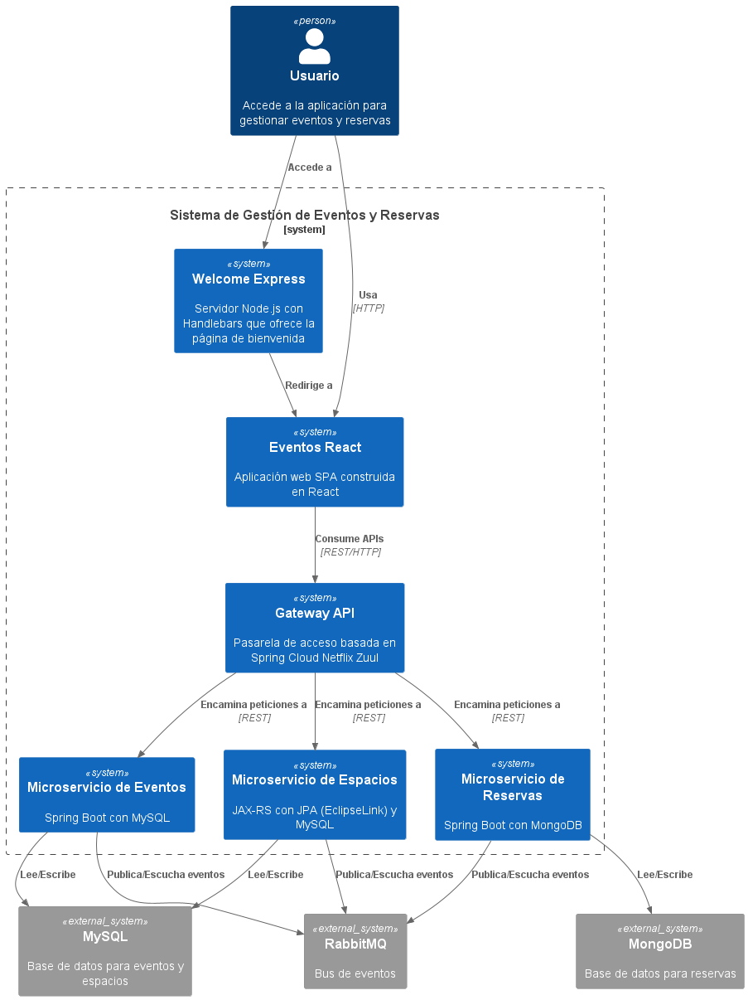

# Introducción

En este documento se presenta un resumen del trabajo realizado en el desarrollo del frontend de la aplicación de desarrollo de aplicaciones web. Concretamente, detallaremos algunos detalles técnicos de la implementación, las tecnologías utilizadas y la arquitectura del sistema. Además, se describirá la funcionalidad implementada en relación a los casos de uso definidos en el proyecto.

## Resumen de tecnologías utilizadas (Elementos desarrollados en DaWeb y ArSo)

En este apartado nos centraremos en hablar de forma resumida y concisa de las tecnologías que hemos utilizado en ambos proyectos, DaWeb y ArSo, para el desarrollo del frontend y backend de la aplicación. En el caso de DaWeb, el desarrollo se ha centrado en la creación de una SPA (Single Page Application) utilizando React y otras tecnologías, mientras que en ArSo se ha utilizado una arquitectura de microservicios con Spring Boot y otros componentes para el backend.

### Arquitectura del Software (ArSo)

En el caso de Arquitectura del Software (ArSo), hemos utilizado diversas tecnologías para el desarrollo de la arquitectura de microservicios (espacios, eventos y reservas). Concretamente, hemos utilizado:

- **Spring Boot**: Framework para el desarrollo de aplicaciones Java que ha sido utilizado para crear los microservicios de reservas y eventos.
- **Spring Security**: Framework de seguridad para aplicaciones Java que ha sido utilizado para gestionar la autenticación y autorización de usuarios en los microservicios.
- **Spring Cloud Netflix Zuul**: Servidor de pasarela que ha sido utilizado para enrutar las peticiones a los distintos microservicios y gestionar la comunicación entre ellos.
- **JPA**: Framework para el acceso a bases de datos que ha sido utilizado para gestionar la persistencia de datos en los microservicios de eventos y espacios físicos. Concretamente, se ha utilizado EclipseLink como proveedor de JPA en el microservicio de espacios físicos e Hibernate en el microservicio de eventos que es el que utiliza por defecto Spring Data JPA.
- **JAX-RS**: API para la creación de servicios RESTful que ha sido utilizada para definir las rutas y endpoints del microservicio de espacios físicos.
- **Spring Data MongoDB**: Framework para el acceso a bases de datos NoSQL que ha sido utilizado para gestionar la persistencia de datos en el microservicio de reservas, permitiendo una integración sencilla con MongoDB.
- **Retrofit**: Biblioteca para la creación de clientes HTTP que ha sido utilizada para realizar peticiones síncronas entre los distintos microservicios de la arquitectura, facilitando la comunicación entre ellos.
- **Spring boot HATEOAS**: Framework que ha sido utilizado para implementar hipermedios en los microservicios, permitiendo una navegación más intuitiva y flexible entre los recursos expuestos por la API.
- **Spring boot AMQP**: Framework que ha sido utilizado para implementar la comunicación asíncrona entre los microservicios mediante el uso de colas de mensajes, facilitando la escalabilidad y resiliencia del sistema. Concretamente, se ha utilizado RabbitMQ como broker de mensajes para gestionar la comunicación entre los microservicios de espacios, eventos y reservas.

### Desarrollo de aplicaciones web (DaWeb)

Entre las distintas tecnologías que hemos utilizado en el desarrollo del frontend, destacamos las siguientes:

- **Node.js**: Entorno de ejecución para JavaScript en el servidor backend que ha sido utilizando principalmente para la página bienvenida a la aplicación.
- **Express-Handlebars**: motor de plantillas utilizado para renderizar la página de bienvenida de forma modular y reutilizable.
- **Bootstrap**: Framework CSS utilizado para el diseño y maquetación de las distintas vista de la aplicación, proporcionando un diseño responsivo y atractivo.
- **Sass**: Preprocesador CSS utilizado para poder modificar los estilos de Bootstrap y personalizar la apariencia de la aplicación de forma más sencilla y eficiente.
- **CSS flex**: Utilizado en varias vistas y componentes React para crear un diseño flexible y adaptativo, permitiendo que los elementos se distribuyan de manera eficiente en el espacio disponible y se ajusten a diferentes tamaños de pantalla.
- **CSS Grid**: Utilizado en algunas vistas y componentes React para crear un diseño flexible y adaptativo con una estructura de cuadrícula, facilitando la disposición de los elementos en la interfaz de usuario.
- **Media Queries**: Implementadas para asegurar que la aplicación se adapte a diferentes tamaños de pantalla, mejorando la experiencia de usuario en dispositivos móviles.
- **React**: Biblioteca de JavaScript utilizada para construir componentes reutilizables y gestionar el estado de la aplicación de forma eficiente. React ha sido utilizado en el resto de vistas y componentes de la aplicación, permitiendo un desarrollo más modular y mantenible.
- **React router**: Utilizado para gestionar la navegación entre las distintas vistas de la aplicación, permitiendo una experiencia de usuario fluida y sin recargas de página con el fin de desarrollar una SPA (Single Page Application).
- **React Bootstrap**: Biblioteca que integra Bootstrap con React, facilitando el uso de componentes de Bootstrap en la aplicación React.
- **React Toastify**: Biblioteca utilizada para mostrar notificaciones y mensajes emergentes de forma sencilla y atractiva, mejorando la experiencia de usuario al proporcionar feedback visual sobre las acciones realizadas en la aplicación.
- **Material UI**: Biblioteca de componentes de interfaz de usuario para React que proporciona una amplia gama de componentes predefinidos y personalizables. Principalmente se ha utilizado para el uso de selectores de fecha y hora, así como otros componentes de formularios.

## Diagrama de arquitectura del sistema

El diagrama de arquitectura del sistema es el que se muestra a continuación. En él se puede observar la arquitectura general de la aplicación, incluyendo los distintos componentes y tecnologías utilizadas en el desarrollo del frontend y backend. Este diagrama nos permite entender cómo interactúan los distintos elementos del sistema y cómo se comunican entre sí.



# Descripción de la funcionalidad implementada en relación a cada caso de uso

En este apartado se describirá la funcionalidad implementada en relación a cada caso de uso definido en el proyecto. Cada caso de uso se detalla con su correspondiente descripción.

## Caso de uso 0: Página de bienvenida desarrollada con Express-Handlebars

Para implementar la página de bienvenida del sistema de gestión de eventos y espacios, se ha desarrollado una aplicación web basada en la arquitectura cliente-servidor utilizando el patrón MVC (Modelo-Vista-Controlador), donde Express.js actúa como controlador y Handlebars como motor de plantillas para las vistas. Esta implementación ejemplifica los conceptos fundamentales de desarrollo web, concretamente, la parte de renderizado del lado del servidor que hemos visto en clase mediante el uso de plantillas Handlebars.

Hemos utilizado algunos aspectos técnicos para conseguir modularización como la implementación de layouts (plantillas base) para mantener la estructura HTML consistente y la utilización de partials para componentes reutilizables. En nuestro caso, hemos utilizado un único layout principal ('main') que define la estructura HTML base, complementado por diversos partials que componen el layout principal ('home') con el fin de lograr modularización y reutilización de código. Entre los distintos 'componentes' o partials encontramos:

- _navbar.hbs_ (barra de navegación superior con logo y botón de inicio de sesión), hero.hbs (sección principal con video de fondo, título y llamada a la acción), _about.hbs_ (información del portal con estructura de dos columnas responsive), _footer.hbs_ (pie de página con enlaces, información de contacto y formulario de suscripción) y _social-icons.hbs_ (componente reutilizable con iconos de redes sociales implementado en múltiples secciones). Esta estructura modular permitió desarrollar una página de bienvenida mantenible, ofreciendo una experiencia de usuario atractiva y adaptable a múltiples dispositivos gracias a la implementación de Media Queries y diseño responsive.

## Caso de uso 1: Inicio de sesión con usuario y contraseña

A partir de este momento, la aplicación se centra en el desarrollo de un SPA (Single Page Application) utilizando React, donde se implementa el resto de la funcionalidad del sistema. En este caso de uso, vamos a explicar dos apartados fundamentales. El inicio de sesión con usuario y contraseña.

Concretamente, lo relativo al inicio de sesión se puede ver en el fichero _LoginPage.jsx_, esta página lo que contiene son tres componentes. Una barra de navegación superior, un formulario de inicio de sesión y un pie de página. El formulario de inicio de sesión se compone de dos campos, uno para el nombre de usuario y otro para la contraseña, así como un botón para enviar el formulario. Cuando el usuario envía el formulario, se realiza una petición POST al servidor con los datos introducidos. Si la autenticación es exitosa, se redirige al usuario a la página principal del sistema. En caso contrario, se muestra un mensaje de error.

La autenticación se gestiona mediante el uso de tokens JWT (JSON Web Tokens), que se generan en el servidor y se envían al cliente tras una autenticación exitosa. Estos tokens se almacenan en el almacenamiento local del navegador y se utilizan para autenticar las peticiones posteriores al servidor, permitiendo así un acceso seguro a las funcionalidades protegidas de la aplicación para cada usuario. El backend de ArSo como tal, también nos envía el mismo token JWT por una cookie HttpOnly, que se almacena en el navegador y se envía automáticamente en las peticiones posteriores al servidor. Esto permite que el usuario permanezca autenticado durante toda su sesión en la aplicación.

Concretamente, hemos definido únicamente dos roles de usuario cuyos usuarios y contraseñas son:

- **Usuario gestor**: gestor, contraseña: gestor
- **Usuario usuario**: usuario, contraseña: usuario

## Caso de uso 2: Inicio de sesión con GitHub (funcionalidad implementada de forma mixta entre DaWeb y ArSo)

Para el inicio de sesión con GitHub, tuvimso que implementar la funcionalidad de forma mixta entre DaWeb y ArSo. En DaWeb, solo se implementó el botón de inicio de sesión con GitHub, que redirige al usuario a la página de autorización de GitHub. Una vez que el usuario autoriza la aplicación, el backend de ArSo redirige al usuario de vuelta a la aplicación con un código de autorización que se le pasa como parámetro en la URL. El usuario autenticado con GitHub recibe el rol usuario. Se adjunta el código relativo a esta funcionalidad en ArSo para poder comprobar la solución implementada.

```java
  @Override
  public void onAuthenticationSuccess(
      HttpServletRequest request, HttpServletResponse response,
        Authentication authentication)
      throws IOException {

    DefaultOAuth2User user =
      (DefaultOAuth2User) authentication.getPrincipal();

    Map<String, Object> claims = fetchUserInfo(user);

    Usuario usuario = servicioAuth.getUsuario(user
        .getAttributes().get("login").toString());

    if (claims != null) {
      // Generamos el token JWT
      String token = servicioAuth.generarToken(claims);

      // Construimos el DTO de respuesta
      AutorizationResponseDto responseDto =
          new AutorizationResponseDto(
              usuario.getId(), usuario.getUsername(), usuario.getRoles(), token);

      response.addCookie(servicioAuth.generarCookie(token));

      // lo pasamos como query -param (base64url-encoded)
      String json      = new ObjectMapper().writeValueAsString(responseDto);
      String base64url = Base64.getUrlEncoder().withoutPadding()
              .encodeToString(json.getBytes(StandardCharsets.UTF_8));

    // ---------- 4) redirección ----------
      String target = "http://localhost:5173?data=" + base64url;
      response.sendRedirect(target);
    }
  }
```

El momento en que nuestro frontend recibe el token JWT, lo almacena en el almacenamiento local del navegador y lo utiliza para autenticar las peticiones posteriores al servidor, permitiendo así un acceso seguro a las funcionalidades protegidas de la aplicación. En este caso, el usuario autenticado con GitHub recibe el rol usuario. El tratamiento de este token se realiza en el componente _ConditionalRedirect.jsx_ donde una vez se monta el componente, se compruba si existe el token JWT en la URL. Si existe, se extrae el token y se almacena en el almacenamiento local del navegador. A continuación, se redirige al usuario a la página principal de la aplicación en función de su rol.

## Caso de uso 3: Gestión de espacios físicos (rol gestor)

El componente con la lógica principal de los espacios se encuentra en _EspaciosPage_. Para la realización de la página de _espacios_ y de _eventos_ se hizo uso de un listado de tipo acordeon _AccordionList.jsx_ adaptando el componente de la libreria de React Boostrap que recibe el tipo componente tarjeta a mostrar. Para ello, se ha implementado un componente llamado _SpaceCard.jsx_ que recibe como parámetros toda la información del espacio y se encarga de mostrarla en una tarjeta. Cuando se monta el componente, se llama a un hook personalizado _useEspacios_ que realiza una petición al servidor para obtener todos los espacios. Además, se ha implementado un botón _DischargeButton_ que, junto con sus variantes, es capaz de generar un modal con un formulario. La variante del botón determina el tipo de formulario que se muestra en el modal, reaprovechando asi la lógica para los eventos.

```jsx
const DischargeButton = ({
  shortButtonLabel,
  buttonLabel,
  children,
  onClose,
  className
}) => {
  const [showModal, setShowModal] = useState(false);

  // lógica para controlar el modal

  return (
    <>
      <Button
        variant="primary"
        className={`text-white discharge-button fw-bold ${className || ''}`}
        onClick={handleShow}
      >
        <span className="button-text-long">{buttonLabel}</span>
        <span className="button-text-short">{shortButtonLabel}</span>
      </Button>

      <Modal
        size="lg"
        aria-labelledby="contained-modal-title-vcenter"
        centered
        show={showModal}
        onHide={handleClose}
      >
        <Modal.Header className="bg-dark" closeButton>
          <Modal.Title className="text-primary fw-bold">
            {buttonLabel}
          </Modal.Title>
        </Modal.Header>
        <Modal.Body>
          {typeof children === 'function' ? children(handleClose) : children}
        </Modal.Body>
      </Modal>
    </>
  );
};
```

## Caso de uso 4: Gestión de eventos (rol gestor)

De forma análoga, para la gestión de eventos se ha implementado un componente llamado _EventCard.jsx_ que recibe como parámetros toda la información del evento y se encarga de mostrarla en una tarjeta. Esta es añadida al componente acordeón previamente mencionado. Este componente se utiliza en la página de gestor para mostrar todos los eventos. Cuando se monta el componente, se llama a un hook personalizado _useEventos_ que realiza una petición al servidor para obtener todos los eventos. Además, se ha implementado una variante del botón _DischargeButton_ que genera su correspondiente formulario.

## Caso de uso 5: Cancelación de eventos (rol gestor)

Para la cancelación y visualización por parte del gestor de los eventos. Se introduce una nueva página llamada _EventoDetailPage.jsx_. Dicha vista proporciona dos zonas: una zona derecha con lan cantidad de reservas realizadas a ese espacio y una zona izquierda donde se pinta la información del evento. En caso de que el evento no este cancelado, se proporciona al usuario la opción de cancelar, en otro caso se muestra el botón inactivo con el texto adjunto 'Cancelado'.

```jsx
<button
  className="btn btn-danger"
  onClick={handleCancel}
  disabled={evento.cancelado}
>
  {evento.cancelado ? 'Cancelado' : 'Cancelar'}
</button>
```

## Caso de uso 6: Cierre temporal de espacios físicos (rol gestor)

Para la cancelación de los espacios, al desplegarse vista de edición de la tarjeta, se proporciona al usuario un botón con la información 'Cancelar'. Dependiendo de si ha sido exitoso o no se hara uso del componente **React Toastify** previamente comentado. El botón actua como un toggle permitiendo su activación en caso de estar cancelado.

## Caso de uso 7: Listado de eventos activos (rol usuario)

Por defecto, la página de usuario únicamente muestra un grid de eventos activos. Para ello, se ha implementado un componente llamado _UserEventCard.jsx_ que recibe como parámetros toda la información del evento y se encarga de mostrarla en una tarjeta. Este componente se utiliza en la página de usuario para mostrar todos los eventos activos. Cuando se monta el componente, se realiza una petición al servidor para obtener todos los eventos. Para ello, se utiliza el hook personalizado '_useEventos.js_' en la página de usuario. Este hook se encarga de realizar la petición al servidor y devolver los eventos activos. El código del hook es el siguiente:

```jsx
export function useEventos() {
  const [eventos, setEventos] = useState([]);
  const [loading, setLoading] = useState(true);
  const [error, setError] = useState(null);

  useEffect(() => {
    const fetchEventos = async () => {
      try {
        setLoading(true);
        const eventosFetch = await getEventos();
        const eventosBase = eventosFetch._embedded?.eventoDTOList || [];

        const eventosConFotos = eventosBase.map(evento => ({
          ...evento,
          fotoEvento: generatePlacesURL()
        }));

        setEventos(eventosConFotos);
        setError(null);
      } catch (err) {
        setError(err.message);
        console.error('Error al cargar los espacios:', err);
      } finally {
        setLoading(false);
      }
    };

    fetchEventos();
  }, []);

  function addEvento(evento) {
    const eventoConFoto = {
      ...evento,
      fotoEvento: generatePlacesURL()
    };
    setEventos(prevEventos => [...prevEventos, eventoConFoto]);
  }

  return { eventos, loading, error, addEvento };
}
```

Una vez obtenemos todos los eventos, se filtran y se muestran únicamente aquellos que están activos. Para ello, se utiliza el siguiente código:

```jsx
const eventosFiltrados = useMemo(() => {
  let resultados = eventos;

  resultados = resultados.filter(evento => {
    const fechaActual = new Date();
    const fechaFin = new Date(evento.ocupacion?.fechaFin);
    return fechaFin >= fechaActual && !evento.cancelado;
  });

  // Otros filtros...
}, [eventos, filtroActual, filtrosAvanzados]);
```

## Caso de uso 8: Filtrado de avanzado de eventos (rol usuario)

Para realizar el filtrado avanzado de eventos, se ha implementado un componente llamado _AdvancedEventFilter.jsx_. A este componente le pasamos como parámetro desde la _UsuarioPage.jsx_ lo siguiente:

```jsx
const AdvancedEventFilter = ({ open, filters, onChange, onReset, ref }) => {
  // Estado local para almacenar cambios temporales
  const [localFilters, setLocalFilters] = useState(filters);

  // Actualizamos el estado local cuando cambian los props
  useEffect(() => {
    setLocalFilters(filters);
  }, [filters]);

  // Exponemos los filtros locales al componente padre
  useImperativeHandle(ref, () => ({
    getFilters: () => localFilters
  }));

  const handleChange = e => {
    const { name, value } = e.target;
    const newFilters = {
      ...localFilters,
      [name]: name === 'numPlazas' ? parseInt(value) || 0 : value
    };
    setLocalFilters(newFilters);

    // IMPORTANTE: Propagar los cambios al componente padre
    onChange(newFilters);
  };

  const handleDateChange = (name, value) => {
    const newFilters = {
      ...localFilters,
      [name]: value
    };
    setLocalFilters(newFilters);

    // IMPORTANTE: Propagar los cambios al componente padre
    onChange(newFilters);
  };
```

Como se puede ver en el anterior código, el componente _AdvancedEventFilter.jsx_ recibe como parámetros los filtros actuales del componente padre, una función para manejar los cambios y otra para resetear los filtros. El componente utiliza un estado local para almacenar los cambios temporales y actualiza este estado cuando cambian los filtros recibidos como props. Además, expone una función `getFilters` que permite al componente padre obtener los filtros actuales. Para poder exponer esta función, se utiliza el hook `useImperativeHandle`, que permite personalizar la instancia del componente expuesta a través de una referencia. En nuestro caso, utilizamos este hook para exponer el estado actual de los filtros al componente padre, permitiendo que este pueda acceder a los filtros actuales y utilizarlos para realizar la búsqueda avanzada de eventos.

Habiendo hecho estos cambios, el componente padre, _UsuarioPage.jsx_, puede acceder a los filtros actuales mediante la referencia al componente _AdvancedEventFilter.jsx_ y, a través de esta referencia y con el método getFilters que expone el hijo se pueden obtener los filtros seleccionados por el usuario. De esta forma, se puede realizar una búsqueda avanzada de eventos en función de los filtros seleccionados por el usuario. El componente _UsuarioPage.jsx_ también se encarga de gestionar la lógica de búsqueda y filtrado de eventos.

## Caso de uso 9: Inscripción a eventos, realización de reservas (rol usuario)

La implementación de este caso de uso es bastante sencilla. El componente que se encarga de almacenar la información asociada a cada evento es el componente _UserEventCard.jsx_. Este componente recibe como parámetros toda la información del evento, además de un manejador para gestionar la inscripción a eventos mediante reservas.

```jsx
function UserEventCard({
  cardTitle,
  cardText,
  eventStartDate,
  eventEndDate,
  eventOrganizer,
  eventLocation,
  eventPhoto,
  eventSpaceName,
  eventCategory,
  eventTotalSeats,
  eventId,
  onHandleSubmit,
  className = ''
}) {
  const handleSubmit = e => {
    e.preventDefault();
    onHandleSubmit({
      idUsuario: user.id,
      idEvento: eventId,
      plazasReservadas: parseInt(e.target.plazasReservadas.value, 10)
    });
  };
}
```

Lo que hacemos es utilizar la función del componente padre _UsuarioPage.jsx_ que se encarga de gestionar la inscripción a eventos mediante reservas '_onHandleSubmit_'. Esta función se encarga de realizar la petición al servidor para crear una reserva asociada al evento.

La lógica asociada a la petición de creación de reserva es la siguiente y se encuentra en el componente _UsuarioPage.jsx_:

```jsx
const handleSubmit = async requestBody => {
  try {
    await darAltaReserva({ requestBody: requestBody });
    toast.success('Reserva creada con éxito', {
      position: 'top-right',
      autoClose: 3000
    });
    setReservas(await getReservasUsuario(user.id));
  } catch (error) {
    console.error('Error al reservar:', error);
    toast.error(
      `Error: ${error.message || 'No se pudo completar la reserva'}`,
      {
        position: 'top-right',
        autoClose: 3000
      }
    );
  }
};
```

## Caso de uso 10: Cancelación de reservas (rol usuario)

Para la gestión de la cancelación de reservas, hemos seguido una dinámica y enfoque similar al caso de uso anterior. En este caso, el componente que se encarga de almacenar la información asociada a cada reserva es el componente _ReservasCard.jsx_. Este componente recibe todas las reservas, además de un manejador para gestionar la cancelación de reservas.

```jsx
const ReservasCard = { reservas, btnCancelado, onCancelado, gestor };
```

Este componente mostrará la información de cada reserva y si el usuario no es gestor, mostrará un botón para cancelar la reserva. El botón de cancelar reserva llamará a la función _onCancelado_ que se encarga de gestionar la cancelación de reservas y le pasará el id de la reserva a cancelar al componente padre _UsuarioPage.jsx_. La lógica asociada a la petición de cancelación de reserva es la siguiente y se encuentra en el componente _UsuarioPage.jsx_:

```jsx
const handleCancelarReserva = async idReserva => {
  try {
    await cancelarReserva(idReserva);
    toast.success('Reserva cancelada exitosamente');

    // Actualizar la lista de reservas
    const nuevasReservas = await getReservasUsuario(user.id);
    setReservas(nuevasReservas);
  } catch (error) {
    console.error('Error al cancelar la reserva:', error);
    toast.error('No se pudo cancelar la reserva');
  }
};
```

## Caso de uso 11: Consulta de reservas activas y todas las reservas (rol usuario)

Para este caso de uso, hemos definido dos _Tab_ distintos dentro de la página de usuario. El primero de ellos muestra las reservas activas del usuario y el segundo muestra todas las reservas realizadas por el usuario, tanto activas como canceladas.

El primer _Tab_ muestra las reservas activas del usuario. Para ello, se utiliza el componente _ReservasCard.jsx_ que recibe como parámetro las reservas activas del usuario y un manejador para gestionar la cancelación de reservas. El componente _ReservasCard.jsx_ se encarga de mostrar la información de cada reserva y si el usuario no es gestor, mostrará un botón para cancelar la reserva.

El código asociado en el _UsuarioPage.jsx_ es el siguiente:

```jsx
<Tab eventKey="reservas" title="Mis Reservas">
  <div className="mt-4">
    <Tabs
      activeKey={subTabActiva}
      onSelect={k => setSubTabActiva(k)}
      id="reservas-subtabs"
      className="mb-3 shadow-sm border rounded"
      variant="pills"
      justify
    >
      <Tab eventKey="activas" title="Mis reservas activas">
        {(() => {
          if (loadingReservas) {
            return (
              <div className="text-center my-4">
                <Spinner animation="border">
                  <span className="visually-hidden">
                    Cargando reservas...
                  </span>
                </Spinner>
              </div>
            );
          }
          if (errorReservas) {
            return <Alert variant="danger">{errorReservas}</Alert>;
          }
          if (reservasActivas.length > 0) {
            return (
              <div className="card shadow-sm">
                <div
                  style={{
                    maxHeight: '400px',
                    overflowY: 'auto',
                    padding: '0 5px'
                  }}
                >
                  <ReservasCard
                    gestor={false}
                    reservas={reservasActivas}
                    btnCancelado={true}
                    onCancelado={handleCancelarReserva}
                  />
                </div>
              </div>
            );
          }
          return (
            <div className="text-center my-4 p-3 bg-light rounded">
              <p>No tienes reservas activas en este momento.</p>
            </div>
          );
        })()}
      </Tab>
      <Tab eventKey="todas" title="Todas mis reservas">
        {(() => {
          if (loadingReservas) {
            return (
              <div className="text-center my-4">
                <Spinner animation="border">
                  <span className="visually-hidden">
                    Cargando reservas...
                  </span>
                </Spinner>
              </div>
            );
          }
          if (errorReservas) {
            return <Alert variant="danger">{errorReservas}</Alert>;
          }
          if (reservas.length > 0) {
            return (
              <div className="card shadow-sm">
                <div
                  style={{
                    maxHeight: '500px',
                    overflowY: 'auto',
                    padding: '0 5px'
                  }}
                >
                  <ReservasCard reservas={reservas} />
                </div>
              </div>
            );
          }
          return (
            <div className="text-center my-4 p-3 bg-light rounded">
              <p>No has realizado ninguna reserva.</p>
            </div>
          );
        })()}
      </Tab>
```

# Discusión y conclusiones del trabajo realizado

A continuación, se presentan las conclusiones del trabajo realizado por ambos componentes del equipo.

- **Fabián Sola Durán**. Bajo mi punto de vista, el proyecto es enriquecedor y ha supuesto una experiencia bastante positiva exceptuando los problemas que hemos presentado a la hora de realizar un desarrollo relativamente "decente". En muchas ocasiones, he tenido que recurrir a la documentación oficial de las tecnologías y diversos tutoriales para aprender a utilizarlas. Además, había incongruencias entre la especificación del proyecto y la especificación del proyecto de ArSo, lo que ha dificultado la implementación de algunas funcionalidades ya que había que modificar diversas partes de ArSo. A pesar de ello, he aprendido mucho sobre el desarrollo de aplicaciones web y ha sido un primer contacto agradable con las tecnologías de desarrollo web. Como mejora de cara al futuro, creo que sería interesante que en alguna asignatura del primer cuatrimestre se tratasen tecnologías como HTML, CSS, BOOTSTRAP y JavaScript de forma introductoria para que en esta asignatura pudiésemos centrarnos en el desarrollo de aplicaciones web de forma más avanzada (ya sea usando React o Express-Handlebars) y así poder centrarnos en el desarrollo de aplicaciones web más complejas en las que se usen buenas prácticas aprendidas en clase.

- **Antonio Pérez Serrano**. El proyecto ha sido positivo e interesante, aunque el principal problema la entrega del enunciado antes de las vacaciones, ya que limitó el avance de otras prácticas. No se tuvo en cuenta que algunas personas tienen iniciativa propia para aprender por su cuenta y podrían haber empezado el proyecto más de un mes antes si hubiera tenido los casos de uso definitivos justo cuando el profesor de ArSo dio por finalizado los contenidos de los de los desarrollos de los tres microservicios a implementar. Además, Partes de la documentación no tuvieron en cuenta a la otra asignatura ya que pidieron implementaciones adicionales como dar de baja reserva lo cual generaba cierto conflicto entre los intereses de ambas asignaturas. Entonces cuando te cruzas con esta situación el proyecto deja de ser productivo porque el tiempo se reduce en exceso lo que da a lugar a la aplicación de malas prácticas/decisiones por la falta de tiempo y el agotamiento sale a relucir.

En líneas generales, el proyecto nos ha resultado útil y ha despertado nuestro interés acerca del desarrollo de aplicaciones con React. Hemos aprendido a utilizar diversas tecnologías y herramientas que nos han permitido desarrollar una aplicación web completa y funcional. A pesar de los desafíos y dificultades encontradas, hemos logrado implementar la mayoría de los casos de uso definidos en el proyecto y hemos adquirido una comprensión más profunda del desarrollo de aplicaciones web modernas.
